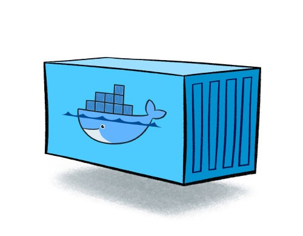

## 
**Containerize The App**

The first step in running the app on Kubernetes is producing a container for the app we can then deploy to Kubernetes


<p id="gdcalert1" ><span style="color: red; font-weight: bold">>>>>>  gd2md-html alert: inline image link here (to images/image1.png). Store image on your image server and adjust path/filename/extension if necessary. </span><br>(<a href="#">Back to top</a>)(<a href="#gdcalert2">Next alert</a>)<br><span style="color: red; font-weight: bold">>>>>> </span></p>





---


### 
**Building A Container**


*   Spring Boot 2.3.x can build a container for you without the need for any additional plugins or files
*   To do this use the Spring Boot Build plugin goal `build-image`


```execute-1
./mvnw spring-boot:build-image

```


*   Running `docker images` will allow you to see the built container


```execute-2
docker images
REPOSITORY                            TAG                 IMAGE ID            CREATED             SIZE
k8s-demo-app                          0.0.1-SNAPSHOT      ab449be57b9d        5 minutes ago       124MB
```


---


### 
**Run The Container**


```execute-1
docker run --name k8s-demo-app -p 8080:8080 k8s-demo-app:0.0.1-SNAPSHOT
```


---


### 
**Test The App Responds**


```execute-2
$ curl http://localhost:8080; echo
Hello World
```


Be sure to stop the docker container before continuing. You can stop the container and remove it by running 
```execute-1
docker rm -f k8s-demo-app 
```

---

